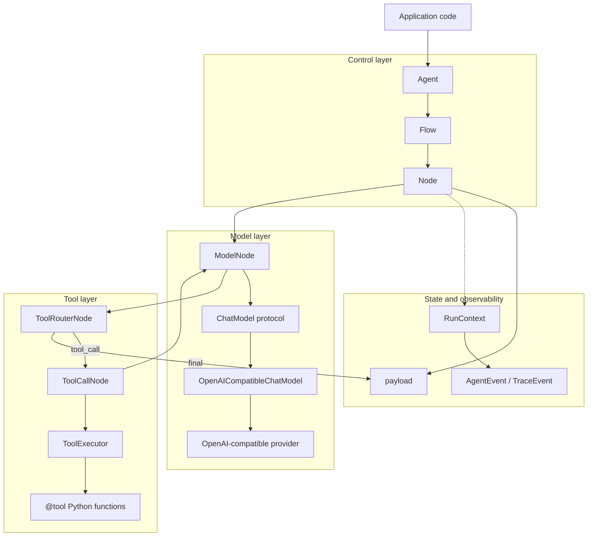
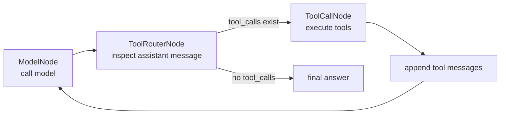

# Agent Core Runtime

Agent Core Runtime is a small Python runtime for building agents from explicit, composable parts. It includes a built-in OpenAI-compatible chat adapter, so a fresh clone can run real model examples after you fill in a local `.env`.

## What It Provides

- `Node`: one unit of work with `exec(payload) -> (action, payload)`.
- `Flow`: routes each action to at most one next node.
- `Agent`: a thin runner around a `Flow`.
- `RunContext`: per-run messages, artifacts, metadata, and UI-friendly runtime events.
- `Tool` and `@tool`: typed Python functions converted into LLM-callable tool schemas.
- `ToolExecutor` and `ToolCallNode`: tool-call parsing, execution, and message appending.
- `ChatModel`, `ModelNode`, and `ToolRouterNode`: provider-neutral model/tool/model loops.
- `OpenAICompatibleChatModel`: built-in adapter for OpenAI-compatible chat completion APIs.

The original payload contract remains the baseline. `RunContext` is an additional runtime layer for richer agent state and event streaming.

## Runtime Layers



## Standard Tool-Agent Loop



Use `build_tool_agent_flow(...)` when you want this common loop without manually wiring nodes.

## Layout

```text
src/agent_core/
  agent.py              # Thin Agent runner
  core/                 # Node, Flow, RunContext, trace/runtime events
  llm/                  # Built-in OpenAI-compatible ChatModel adapter
  models.py             # Provider-neutral ChatModel protocol
  nodes/                # Reusable agent-loop nodes
  tools/                # Tool decorator, executor, file tools, tool-call node
examples/
  basic_flow.py         # Minimal action routing
  tool_chatbot.py       # Local fake-model tool loop
  01_basic_agent.py     # Real model, no tools
  02_custom_prompt.py   # Real model with a custom system prompt
  03_custom_tool.py     # Tool decorator and schema generation
  04_tool_agent.py      # Real model with tool calls
tests/                  # Runtime-only unit tests
```

## Install

```powershell
uv sync
```

Copy the env template:

```powershell
Copy-Item .env.example .env
```

Then set `OPENAI_API_KEY` in `.env`. `DEEPSEEK_API_KEY` is also supported. The defaults target DeepSeek:

```text
OPENAI_BASE_URL=https://api.deepseek.com
OPENAI_MODEL=deepseek-v4-flash
```

The `.env` file is ignored by Git.

## Basic Flow

```python
from agent_core import Agent, CallableNode, Flow

def classify(payload: dict) -> tuple[str, dict]:
    return "question" if payload["text"].endswith("?") else "statement", payload

def answer(payload: dict) -> dict:
    payload["answer"] = "received"
    return payload

start = CallableNode(classify)
answer_node = CallableNode(answer)

start - "question" >> answer_node
start - "statement" >> answer_node

result = Agent(Flow(start)).run({"text": "Hello?"})
print(result.payload["answer"])
```

Run:

```powershell
uv run python examples/basic_flow.py
```

## Real Model Examples

Examples are ordered from small to complete:

```powershell
uv run python examples/01_basic_agent.py
uv run python examples/02_custom_prompt.py
uv run python examples/03_custom_tool.py
uv run python examples/04_tool_agent.py
```

The built-in `agent_core.build_model_from_env()` helper creates an OpenAI-compatible `ChatModel` from `.env`.

## Tools

```python
from typing import Annotated, Literal

from agent_core import tool

@tool(description="Look up demo weather for a supported city.")
def get_weather(
    city: Annotated[Literal["Shanghai", "Tokyo"], "English city name."],
) -> dict[str, str]:
    return {"city": city, "condition": "sunny"}
```

The tool schema is derived from the function signature, type annotations, and `Annotated` descriptions.

## Runtime Events

Every flow run returns a context:

```python
result = agent.run({"history": []})
events = [event.to_dict() for event in result.context.events]
messages = result.context.messages
```

Nodes can also emit events while running:

```python
from agent_core import get_current_context

context = get_current_context()
if context is not None:
    context.emit("custom.event", category="custom", data={"ok": True})
```

## Validation

```powershell
uv run python -m unittest discover -s tests
uv run python -m compileall src tests examples
```

