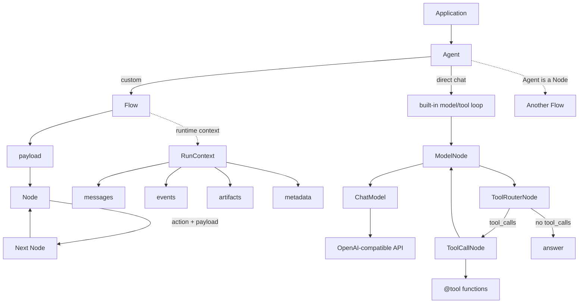

# Agent Core Runtime

Agent Core Runtime is a small Python runtime for building tool-using agents from a few explicit pieces: `Node`, `Flow`, `RunContext`, `Tool`, and `Agent`.

[Chinese README](README.zh-CN.md)

## Why This Exists

The runtime is meant to be easy to read and easy to replace:

- `Node` is one unit of work.
- `Flow` connects nodes by action names.
- `Agent` is also a `Node`, so an agent can run alone or sit inside a larger flow.
- `RunContext` carries messages, events, metadata, and artifacts for one run.
- `payload` carries explicit business data between nodes and is returned by the flow.
- `@tool` turns typed Python functions into OpenAI-compatible tool schemas.
- `LLM` is the default OpenAI-compatible model. It loads `.env` by itself.

You can build a normal chat agent in one declaration, or wire your own flow when the loop needs custom logic.

## Runtime Shape



## Package Layout

```text
src/agent_core/
  agent.py              # Agent: direct chat runner and embeddable Node
  core/                 # Node, Flow, RunContext, trace events
  llm/                  # LLM, ChatModel protocol, ModelNode, router
  tools/                # @tool, ToolExecutor, ToolCallNode, file tools
examples/
  01_basic_agent.py     # Node and Flow only
  02_custom_prompt.py   # Real model call with a custom prompt
  03_custom_tool.py     # Tool schema and execution
  04_tool_agent.py      # Manually wired model-tool-model loop
  05_custom_agent.py    # Direct Agent(instructions, tools)
tests/
```

## Install

```powershell
uv sync
Copy-Item .env.example .env
```

Set this in `.env`:

```text
LLM_API_KEY=...
```

Defaults target DeepSeek:

```text
LLM_BASE_URL=https://api.deepseek.com
LLM_MODEL=deepseek-v4-flash
```

`.env` is ignored by Git.

## Quick Agent

```python
from typing import Annotated

from agent_core import Agent, tool

@tool(description="Search private notes.")
def search_notes(topic: Annotated[str, "Topic to search."]) -> dict[str, str]:
    return {"topic": topic, "result": "mock note"}

agent = Agent(
    instructions="You are a concise research assistant.",
    tools=[search_notes],
    chat_kwargs={"tool_choice": "auto"},
)

context = agent.new_context()
answer = agent.chat("Draft a short evaluation plan.", context=context)
print(answer)
```

## Custom Flow

Use explicit nodes when the agent loop is not a simple chat loop:

```python
from agent_core import Agent, CallableNode, Flow

def classify(payload: dict) -> tuple[str, dict]:
    return "question" if payload["text"].endswith("?") else "statement", payload

def answer(payload: dict) -> dict:
    payload["answer"] = "received"
    return payload

router = CallableNode(classify)
answer_node = CallableNode(answer)

router - "question" >> answer_node
router - "statement" >> answer_node

result = Agent(Flow(router)).run({"text": "Hello?"})
print(result.payload["answer"])
```

Because `Agent` is a `Node`, you can compose agents:

```python
researcher = Agent(model=model, instructions="Research.", tools=[search_notes])
writer = Agent(model=model, instructions="Write the final response.")

researcher >> writer
team = Agent(Flow(researcher))
```

Use `Agent(flow, action=None)` when a sub-agent should expose the final action from its inner flow instead of always returning `"default"`.

## Examples

Run the examples in order:

```powershell
uv run python examples/01_basic_agent.py
uv run python examples/02_custom_prompt.py
uv run python examples/03_custom_tool.py
uv run python examples/04_tool_agent.py --stream --context messages
uv run python examples/05_custom_agent.py
```

`04_tool_agent.py` supports:

- `--stream`: stream the final assistant response.
- `--context summary|messages|events|artifacts|all|none`: inspect the run context.

## Runtime Events

Each run returns a `RunContext`:

```python
result = agent.run({"text": "hello"})
messages = result.context.messages
events = [event.to_dict() for event in result.context.events]
```

Nodes can also write to the active context:

```python
from agent_core import get_current_context

context = get_current_context()
if context:
    context.set_artifact("note", "saved")
```

Keep business state in `payload` and runtime/session data in `RunContext`. For example, a router decision or report draft belongs in `result.payload`; streamed model deltas, messages, UI events, and artifacts belong in `result.context`.

## Validate

```powershell
uv run python -m unittest discover -s tests
uv run python -m compileall src tests examples
```
