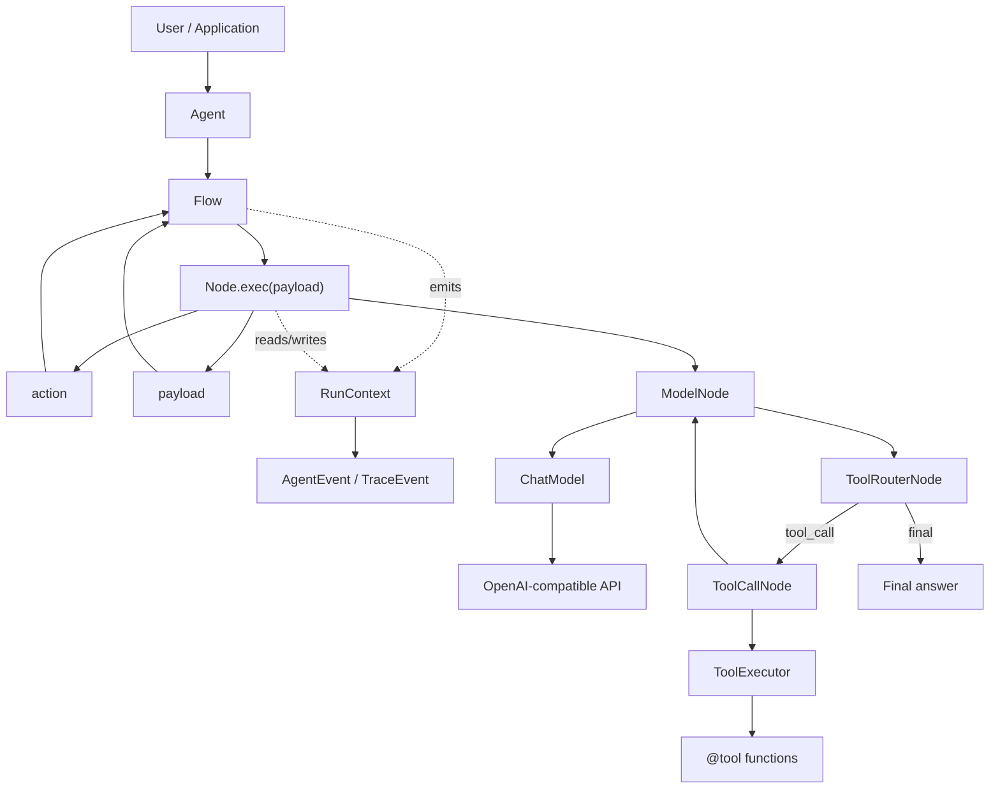

# Agent Core Runtime

Agent Core Runtime is a lightweight Python runtime for building tool-using agents from explicit `Node` and `Flow` primitives.

## Read This README In

- [English](README.en.md)
- [中文](README.zh-CN.md)

## Quick Routes

- Runtime package: `src/agent_core/`
- LLM adapter: `src/agent_core/llm/openai_compatible.py`
- Tool system: `src/agent_core/tools/`
- Reusable agent-loop nodes: `src/agent_core/nodes/`
- Examples: `examples/`
- Runtime design notes: `docs/agent-core.md`

## Runtime Shape



## Quick Start

```powershell
uv sync
Copy-Item .env.example .env
```

Set `OPENAI_API_KEY` or `DEEPSEEK_API_KEY` in `.env`, then run:

```powershell
uv run python examples/01_basic_agent.py
uv run python examples/04_tool_agent.py
```

