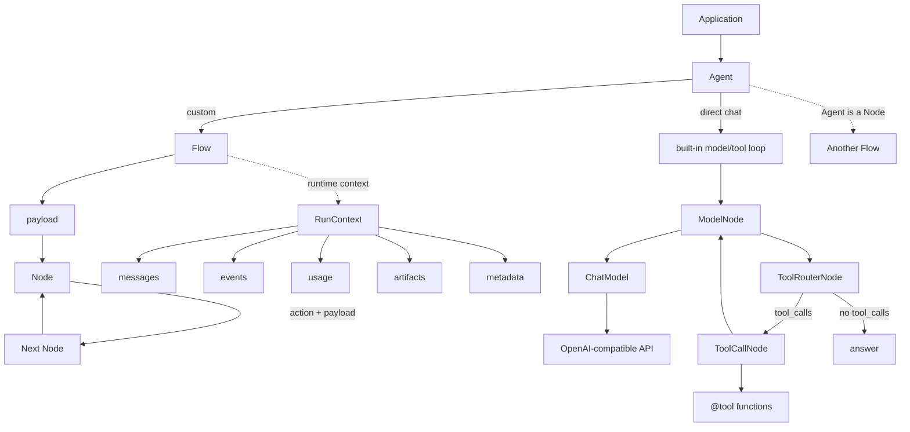

# Agent Core Runtime

[](https://pypi.org/project/friday-agent-core/)
[](https://github.com/Lancetwang/agent-core-runtime/actions/workflows/ci.yml)
[](LICENSE)
[](https://pypi.org/project/friday-agent-core/)

Agent Core Runtime is a small Python runtime for building tool-using agents from a few explicit pieces: `Node`, `Flow`, `RunContext`, `Tool`, and `Agent`.

[Chinese README](README.zh-CN.md) · [API Reference](docs/api.md) · [Design](docs/agent-core.md) · [Changelog](CHANGELOG.md) · [Contributing](CONTRIBUTING.md)

## Why This Exists

The runtime is meant to be easy to read and easy to replace:

- `Node` is one unit of work.
- `Flow` connects nodes by action names.
- `Agent` is also a `Node`, so an agent can run alone or sit inside a larger flow.
- `RunContext` carries scoped messages, one event stream, metadata, artifacts, and cumulative model usage for a caller-owned session.
- `payload` carries explicit business data between nodes and is returned by the flow.
- `@tool` turns typed Python functions into OpenAI-compatible tool schemas.
- `LLM` is the default OpenAI-compatible model adapter. Configuration comes from constructor arguments or the process environment.

You can build a normal chat agent in one declaration, or wire your own flow when the loop needs custom logic.

## Scope and Boundary

The runtime's story is deliberately small: it is the minimal unit that runs one agent, and the same pieces compose into sequential workflows and nested agent systems because `Agent` is a `Node`. It owns *execution* — flows, model and tool calls, and the caller-owned `RunContext`. Execution is synchronous; `parallel=True` tools only add bounded thread-pool concurrency within one tool batch.

Everything that makes a product an agent product lives above it, in a harness: prompt layering, session persistence, context compaction, memory, permissions, verification loops, and user surfaces. [Friday](https://github.com/Lancetwang/friday) is one such harness; its [architecture doc](https://github.com/Lancetwang/friday/blob/main/docs/architecture.md) describes this boundary from the consumer side.

The contract for harness authors: drive the runtime through its public API — compose flows from published nodes, run them via `Agent`, and use `RunContext` through `add_message` / `get_messages` / `metadata` / `artifacts` / `emit` / `observe` / `notify`, usage snapshots, and the event subscriptions. When conversation history must change (compaction, resume), build a fresh context and replay messages through that API instead of editing the runtime's internal bookkeeping.

## Runtime Shape


```mermaid
flowchart TD
    App["Application"] --> Agent["Agent"]
    Agent -->|"direct chat"| BuiltIn["built-in model/tool loop"]
    Agent -->|"custom"| Flow["Flow"]
    Agent -. "Agent is a Node" .-> OuterFlow["Another Flow"]

    Flow --> Data["payload"]
    Data --> Node["Node"]
    Node -->|"action + payload"| Next["Next Node"]
    Next --> Node

    Flow -. "runtime context" .-> Context["RunContext"]
    Context --> Messages["messages"]
    Context --> Events["events"]
    Context --> Usage["usage"]
    Context --> Artifacts["artifacts"]
    Context --> Metadata["metadata"]

    BuiltIn --> ModelNode["ModelNode"]
    ModelNode --> ChatModel["ChatModel"]
    ChatModel --> OpenAI["OpenAI-compatible API"]
    ModelNode --> Router["ToolRouterNode"]
    Router -->|"tool_calls"| ToolNode["ToolCallNode"]
    ToolNode --> Tools["@tool functions"]
    ToolNode --> ModelNode
    Router -->|"no tool_calls"| Answer["answer"]
```

## Package Layout

```text
src/agent_core/
  agent.py              # Agent: direct chat runner and embeddable Node
  core/                 # Node, Flow, RunContext, trace events
  llm/                  # LLM, ChatModel protocol, ModelNode, router
  tools/                # @tool, ToolExecutor, ToolCallNode
examples/
  01_basic_agent.py     # Node and Flow only
  02_custom_prompt.py   # Real model call with a custom prompt
  03_custom_tool.py     # Tool schema and execution
  04_tool_agent.py      # Manually wired model-tool-model loop
  05_custom_agent.py    # Direct Agent(instructions, tools)
tests/
```

## Install

```powershell
uv add friday-agent-core
```

Or with pip:

```powershell
pip install friday-agent-core
```

The distribution name is `friday-agent-core`; the import name stays `agent_core`. To develop the runtime itself, clone this repository and run `uv sync`.

Verify the installed package without an API key or model call:

```powershell
python -c "import agent_core; print(agent_core.__version__)"
python -m agent_core --version
python -m agent_core check
```

`check` executes a local `Node -> Flow -> RunContext` smoke test. It confirms
that the installed runtime can execute; provider credentials and model
connectivity belong to the consuming harness and are intentionally not tested.

With `LLM_API_KEY` / `LLM_MODEL` set, `python -m agent_core chat` starts a
minimal interactive chat built from `Agent` + `LLM` (`--instructions`,
`--max-steps`, `--no-stream` to configure it).

Set model credentials in the process environment or pass them to `LLM(...)`:

```powershell
$env:LLM_API_KEY = "..."
$env:LLM_BASE_URL = "https://api.example.com"
$env:LLM_MODEL = "model-name"
```

Applications with their own configuration or secret store can inject values directly:

```python
from agent_core import LLM

def build_model(api_key: str) -> LLM:
    return LLM(
        api_key=api_key,
        base_url="https://api.example.com",
        model="model-name",
    )
```

Core deliberately does not discover or parse `.env` files. A consuming application may still load one itself, use an OS keychain, read a database, or implement `ChatModel`; only the normalized model boundary matters to the runtime.

## Quick Agent

```python
from typing import Annotated

from agent_core import Agent, tool

@tool(description="Search private notes.")
def search_notes(topic: Annotated[str, "Topic to search."]) -> dict[str, str]:
    return {"topic": topic, "result": "mock note"}

agent = Agent(
    instructions="You are a concise research assistant.",
    tools=[search_notes],
    stream=True,
    chat_kwargs={"tool_choice": "auto"},
)

context = agent.new_context()
answer = agent.chat("Draft a short evaluation plan.", context=context)
print(answer)
```

## Custom Flow

Use explicit nodes when the agent loop is not a simple chat loop:

```python
from agent_core import Agent, CallableNode, ExecResult, Flow

def classify(payload: dict) -> ExecResult:
    return ExecResult(
        "question" if payload["text"].endswith("?") else "statement", payload
    )

def answer(payload: dict) -> dict:
    payload["answer"] = "received"
    return payload

router = CallableNode(classify)
answer_node = CallableNode(answer)

router - "question" >> answer_node
router - "statement" >> answer_node

result = Agent(Flow(router)).run({"text": "Hello?"})
print(result.payload["answer"])
```

Because `Agent` is a `Node`, you can compose agents:

```python
researcher = Agent(model=model, instructions="Research.", tools=[search_notes])
writer = Agent(model=model, instructions="Write the final response.")

researcher - "final" >> writer
team = Agent(Flow(researcher))
```

When an `Agent` is used as a node, it exposes the final action from its inner flow. Pass `action="some_action"` only when you want to force a fixed outward action.

## Examples

Run the examples in order:

```powershell
uv run python examples/01_basic_agent.py
uv run python examples/02_custom_prompt.py
uv run python examples/03_custom_tool.py
uv run python examples/04_tool_agent.py --context messages
uv run python examples/05_custom_agent.py
```

LLM examples stream by default. Use `--no-stream` to print full responses after completion.

`04_tool_agent.py` also supports:

- `--interactive`: start an interactive loop.
- `--context summary|messages|events|artifacts|all|none`: inspect the run context.

In your own agent, use `Agent(..., stream=False)` to disable streaming by default, or override one call with `agent.chat(..., stream=False)`.

## Runtime Events

Each run returns a `RunContext`:

```python
result = agent.run({"text": "hello"})
messages = result.context.messages
events = [event.to_dict() for event in result.context.events]
usage = result.usage.to_dict()
```

A context may be reused across `Agent.chat` calls to preserve a conversation.
Its `run_id`, messages, events, and cumulative usage then span those calls;
`FlowRunResult.usage` remains the delta for the current invocation.

Streaming OpenAI-compatible models emit `model.delta` for answer text and
`model.reasoning.delta` for provider reasoning, allowing a harness to render
the two channels independently.

`RunUsage` accumulates every model request in the flow, including streamed responses. Input and output totals are exact when every provider response includes usage; otherwise the totals are reported as unknown instead of a misleading partial sum.

Nodes can also write to the active context:

```python
from agent_core import get_current_context

context = get_current_context()
if context:
    context.set_artifact("note", "saved")
```

Keep business state in `payload` and runtime/session data in `RunContext`. For example, a router decision, plan, or artifact path belongs in `result.payload`; streamed model deltas, messages, UI events, and artifact metadata belong in `result.context`. Large artifacts such as full reports should live in files, databases, or object storage, with payload/context carrying references rather than the full content.

In multi-agent flows, `RunContext` is shared for events, usage, artifacts, and metadata, but each `Agent` gets an isolated message scope for LLM input. This keeps the observable run unified without leaking one agent's prompt/history into another agent's model call.

## Validate

```powershell
uv run ruff check src tests examples
uv run pyright
uv run coverage run -m unittest discover -s tests
uv run coverage report
uv run python -m compileall src tests examples
```
