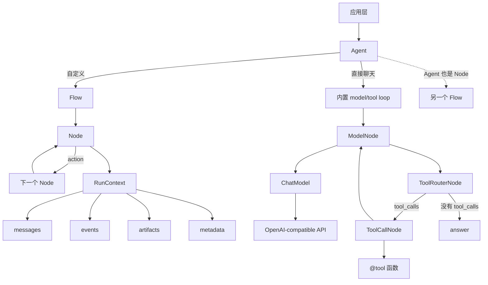

# Agent Core Runtime

[English README](README.md)

Agent Core Runtime 是一个轻量级 Python agent runtime。它只保留几个明确的元件：`Node`、`Flow`、`RunContext`、`Tool` 和 `Agent`。

## 这个项目提供什么

它的目标是足够小、足够直接，也方便你替换其中任何一层：

- `Node`：一个工作单元。
- `Flow`：根据 action 名称把节点连起来。
- `Agent`：本身也是 `Node`，既可以单独运行，也可以嵌进更大的 flow。
- `RunContext`：保存一次运行中的 messages、events、metadata 和 artifacts。
- `@tool`：把带类型标注的 Python 函数转换成 OpenAI-compatible tool schema。
- `OpenAICompatibleChatModel`：对 OpenAI SDK 的薄封装。

你可以一行声明一个普通工具 agent；如果需要特殊循环，也可以自己连节点。

## 运行结构



## 项目结构

```text
src/agent_core/
  agent.py              # Agent：直接聊天入口，也是可嵌套的 Node
  core/                 # Node, Flow, RunContext, trace events
  llm/                  # ChatModel 协议、ModelNode、router、OpenAI adapter
  tools/                # @tool, ToolExecutor, ToolCallNode, file tools
examples/
  01_basic_agent.py     # 只使用 Node 和 Flow
  02_custom_prompt.py   # 真实模型调用和自定义 prompt
  03_custom_tool.py     # 工具 schema 和执行
  04_tool_agent.py      # 手动连接 model-tool-model loop
  05_custom_agent.py    # 直接 Agent(model, instructions, tools)
tests/
```

## 安装

```powershell
uv sync
Copy-Item .env.example .env
```

在 `.env` 中填写其中一个：

```text
OPENAI_API_KEY=...
# 或
DEEPSEEK_API_KEY=...
```

默认配置面向 DeepSeek：

```text
OPENAI_BASE_URL=https://api.deepseek.com
OPENAI_MODEL=deepseek-v4-flash
```

`.env` 已被 Git 忽略。

## 快速声明 Agent

```python
from typing import Annotated

from agent_core import Agent, build_model_from_env, tool

@tool(description="Search private notes.")
def search_notes(topic: Annotated[str, "Topic to search."]) -> dict[str, str]:
    return {"topic": topic, "result": "mock note"}

agent = Agent(
    model=build_model_from_env(),
    instructions="You are a concise research assistant.",
    tools=[search_notes],
    chat_kwargs={"tool_choice": "auto"},
)

context = agent.new_context()
answer = agent.chat("Draft a short evaluation plan.", context=context)
print(answer)
```

## 自定义 Flow

当你不想用普通聊天循环时，就直接连节点：

```python
from agent_core import Agent, CallableNode, Flow

def classify(payload: dict) -> tuple[str, dict]:
    return "question" if payload["text"].endswith("?") else "statement", payload

def answer(payload: dict) -> dict:
    payload["answer"] = "received"
    return payload

router = CallableNode(classify)
answer_node = CallableNode(answer)

router - "question" >> answer_node
router - "statement" >> answer_node

result = Agent(Flow(router)).run({"text": "Hello?"})
print(result.payload["answer"])
```

因为 `Agent` 本身也是 `Node`，所以 agent 可以继续组合成更大的 agent：

```python
researcher = Agent(model=model, instructions="Research.", tools=[search_notes])
writer = Agent(model=model, instructions="Write the final response.")

researcher >> writer
team = Agent(Flow(researcher))
```

如果希望子 agent 把内部 flow 的最终 action 透传给外层 flow，可以使用 `Agent(flow, action=None)`。

## 示例

按顺序运行：

```powershell
uv run python examples/01_basic_agent.py
uv run python examples/02_custom_prompt.py
uv run python examples/03_custom_tool.py
uv run python examples/04_tool_agent.py --stream --context messages
uv run python examples/05_custom_agent.py
```

`04_tool_agent.py` 支持：

- `--stream`：流式输出最终 assistant 回复。
- `--context summary|messages|events|artifacts|all|none`：查看运行上下文。

## Runtime Events

每次运行都会返回 `RunContext`：

```python
result = agent.run({"text": "hello"})
messages = result.context.messages
events = [event.to_dict() for event in result.context.events]
```

节点内部也可以写入当前 context：

```python
from agent_core import get_current_context

context = get_current_context()
if context:
    context.set_artifact("note", "saved")
```

## 验证

```powershell
uv run python -m unittest discover -s tests
uv run python -m compileall src tests examples
```
