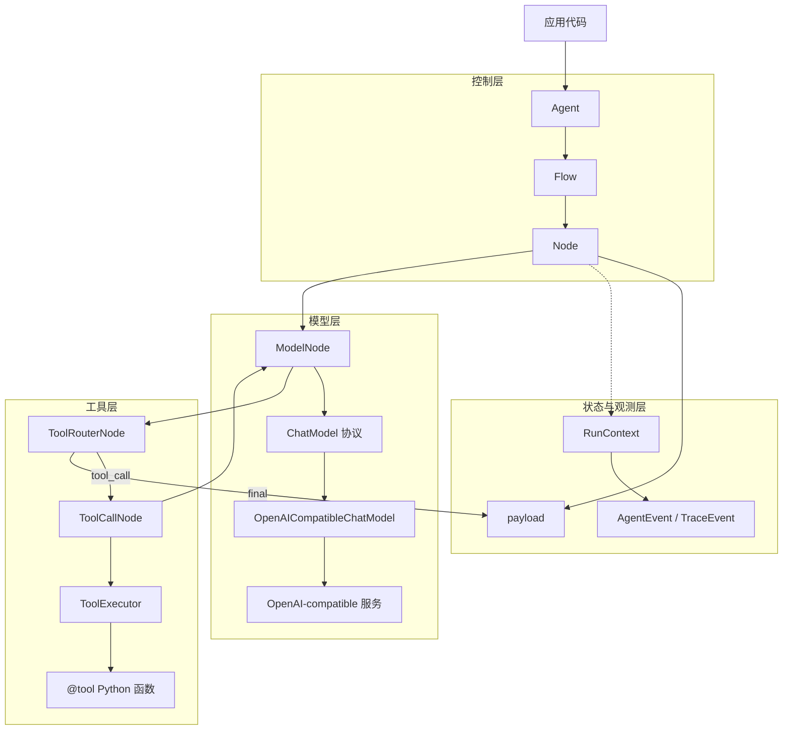
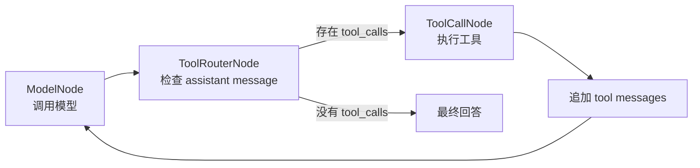

# Agent Core Runtime

Agent Core Runtime 是一个轻量级 Python agent runtime，用显式、可组合的 `Node` 和 `Flow` 来搭建 agent。它内置了 OpenAI-compatible 的模型适配器，所以 clone 后只要在本地 `.env` 填 key，就可以直接跑真实模型示例。

## 提供什么

- `Node`：一个处理单元，接口是 `exec(payload) -> (action, payload)`。
- `Flow`：根据 `action` 路由到下一个节点，每个 action 最多对应一个 next node。
- `Agent`：对 `Flow` 的薄封装，负责运行。
- `RunContext`：保存一次运行中的 messages、artifacts、metadata 和适合 UI 展示的 runtime events。
- `Tool` 和 `@tool`：把有类型标注的 Python 函数转换成 LLM 可调用工具 schema。
- `ToolExecutor` 和 `ToolCallNode`：解析工具调用、执行工具、追加 tool message。
- `ChatModel`、`ModelNode`、`ToolRouterNode`：通用的 model/tool/model 回路。
- `OpenAICompatibleChatModel`：内置 OpenAI-compatible chat completion 适配器。

`payload` 仍然是最基础的节点传递机制；`RunContext` 是额外的运行上下文层，用来承载更丰富的 agent 状态和事件流。

## 运行层级



## 标准工具 Agent 回路



常见的工具 agent 可以直接用 `build_tool_agent_flow(...)` 搭出来，不需要手动连接每个节点。

## 项目结构

```text
src/agent_core/
  agent.py              # Agent runner
  core/                 # Node, Flow, RunContext, trace/runtime events
  llm/                  # 内置 OpenAI-compatible ChatModel 适配器
  models.py             # 与供应商无关的 ChatModel 协议
  nodes/                # 可复用 agent-loop 节点
  tools/                # Tool 装饰器、执行器、文件工具、工具调用节点
examples/
  basic_flow.py         # 最小 action routing
  tool_chatbot.py       # 本地 fake model 工具回路
  01_basic_agent.py     # 真实模型，无工具
  02_custom_prompt.py   # 真实模型，自定义 system prompt
  03_custom_tool.py     # 工具定义和 schema 生成
  04_tool_agent.py      # 真实模型 + 工具调用
tests/                  # runtime 单元测试
```

## 安装

```powershell
uv sync
```

复制环境变量模板：

```powershell
Copy-Item .env.example .env
```

然后在 `.env` 中填写 `OPENAI_API_KEY`。也支持 `DEEPSEEK_API_KEY`。默认配置面向 DeepSeek：

```text
OPENAI_BASE_URL=https://api.deepseek.com
OPENAI_MODEL=deepseek-v4-flash
```

`.env` 已被 Git 忽略，不会提交到仓库。

## 基础 Flow

```python
from agent_core import Agent, CallableNode, Flow

def classify(payload: dict) -> tuple[str, dict]:
    return "question" if payload["text"].endswith("?") else "statement", payload

def answer(payload: dict) -> dict:
    payload["answer"] = "received"
    return payload

start = CallableNode(classify)
answer_node = CallableNode(answer)

start - "question" >> answer_node
start - "statement" >> answer_node

result = Agent(Flow(start)).run({"text": "Hello?"})
print(result.payload["answer"])
```

运行：

```powershell
uv run python examples/basic_flow.py
```

## 真实模型示例

示例按从简单到完整排列：

```powershell
uv run python examples/01_basic_agent.py
uv run python examples/02_custom_prompt.py
uv run python examples/03_custom_tool.py
uv run python examples/04_tool_agent.py
```

内置的 `agent_core.build_model_from_env()` 会从 `.env` 创建 OpenAI-compatible 的 `ChatModel`。

## 工具定义

```python
from typing import Annotated, Literal

from agent_core import tool

@tool(description="Look up demo weather for a supported city.")
def get_weather(
    city: Annotated[Literal["Shanghai", "Tokyo"], "English city name."],
) -> dict[str, str]:
    return {"city": city, "condition": "sunny"}
```

工具 schema 会从函数签名、类型标注和 `Annotated` 描述中生成。

## Runtime Events

每次 flow 运行都会返回 context：

```python
result = agent.run({"history": []})
events = [event.to_dict() for event in result.context.events]
messages = result.context.messages
```

节点运行中也可以主动发事件：

```python
from agent_core import get_current_context

context = get_current_context()
if context is not None:
    context.emit("custom.event", category="custom", data={"ok": True})
```

## 验证

```powershell
uv run python -m unittest discover -s tests
uv run python -m compileall src tests examples
```

