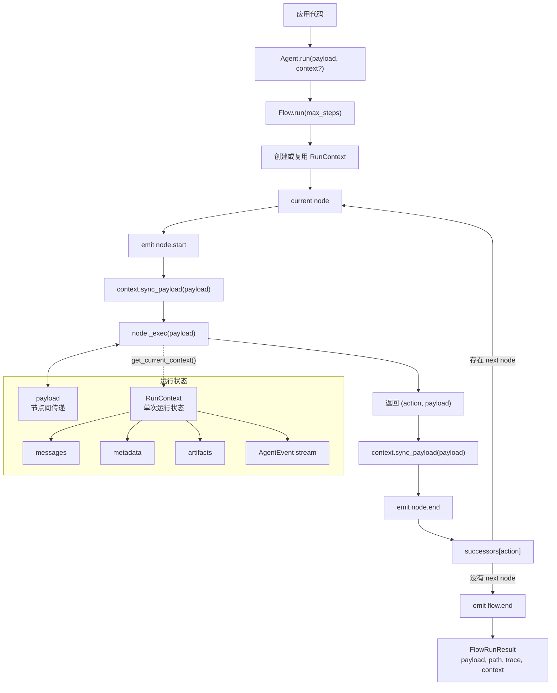
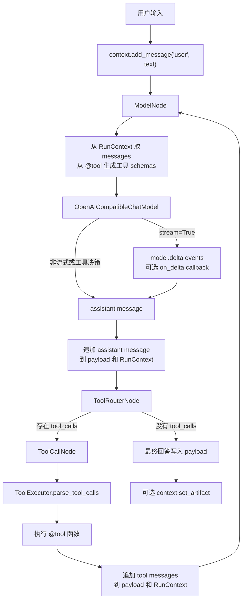

# Agent Core Runtime

[English README](README.md)

Agent Core Runtime 是一个轻量级 Python agent runtime，用显式、可组合的 `Node` 和 `Flow` 搭建 agent。它内置了 OpenAI-compatible 模型适配器，所以 clone 后只要在本地 `.env` 填好 key，就可以直接跑真实模型示例。

## 提供什么

- `Node`：一个处理单元，接口是 `exec(payload) -> (action, payload)`。
- `Flow`：根据 `action` 路由到下一个节点，每个 action 最多对应一个 next node。
- `Agent`：对 `Flow` 的薄封装，负责运行。
- `RunContext`：保存一次运行中的 messages、artifacts、metadata 和适合 UI 展示的 runtime events。
- `Tool` 和 `@tool`：把有类型标注的 Python 函数转换成 LLM 可调用工具 schema。
- `ToolExecutor` 和 `ToolCallNode`：解析工具调用、执行工具、追加 tool message。
- `ChatModel`、`ModelNode`、`ToolRouterNode`：通用的 model/tool/model 回路。
- `OpenAICompatibleChatModel`：内置 OpenAI-compatible chat completion 适配器。

`payload` 仍然是最基础的节点传递机制；`RunContext` 是额外的运行上下文层，用来承载更丰富的 agent 状态和事件流。

## 运行执行逻辑



`payload` 是节点之间最直接的传递对象。`RunContext` 是单次运行的持久状态层，用来承载对话消息、UI 事件、metadata 和 artifacts。

## 工具 Agent 与流式回路



常见的工具 agent 可以直接用 `build_tool_agent_flow(...)` 搭出来，不需要手动连接每一个节点。

## 项目结构

```text
src/agent_core/
  agent.py              # Agent runner
  core/                 # Node, Flow, RunContext, trace/runtime events
  llm/                  # 内置 OpenAI-compatible ChatModel 适配器
  models.py             # 与供应商无关的 ChatModel 协议
  nodes/                # 可复用 agent-loop 节点
  tools/                # Tool 装饰器、执行器、文件工具、工具调用节点
examples/
  01_basic_agent.py     # 纯 Node/Flow action routing
  02_custom_prompt.py   # 真实模型，展示 ModelNode 和 RunContext
  03_custom_tool.py     # @tool schema 生成和 ToolExecutor
  04_tool_agent.py      # Context-first 的 model/tool/model 回路
  05_custom_agent.py    # 应用层客制化 agent 包装方式
  _openai_compatible.py # 示例共享 helper，不是公开 API
tests/                  # runtime 单元测试
```

## 安装

```powershell
uv sync
```

复制环境变量模板：

```powershell
Copy-Item .env.example .env
```

然后在 `.env` 中填写 `OPENAI_API_KEY`。也支持 `DEEPSEEK_API_KEY`。默认配置面向 DeepSeek：

```text
OPENAI_BASE_URL=https://api.deepseek.com
OPENAI_MODEL=deepseek-v4-flash
```

`.env` 已被 Git 忽略，不会提交到仓库。

## 示例顺序

示例按从小到完整排列：

```powershell
uv run python examples/01_basic_agent.py
uv run python examples/02_custom_prompt.py
uv run python examples/03_custom_tool.py
uv run python examples/04_tool_agent.py --events
uv run python examples/04_tool_agent.py --stream --context messages
uv run python examples/05_custom_agent.py
```

这组 case 的顺序是：

- `01_basic_agent.py`：不需要 LLM，只展示 `CallableNode`、分支 action、`Flow` 和 trace。
- `02_custom_prompt.py`：通过 `ModelNode` 真实调用模型，messages 从 payload 构建，事件进入 `RunContext`。
- `03_custom_tool.py`：Python 函数变成 `Tool`，导出 OpenAI-compatible schema，并通过 `ToolExecutor` 执行。
- `04_tool_agent.py`：完整的 model-tool-model 回路，但 messages、实时 events、metadata 和 artifacts 都放在 `RunContext`，payload 只承载本次运行的小输入。
- `05_custom_agent.py`：展示如何把 instructions、tools、flow 和持久化 context 包装成自己的客制化 agent。

`04_tool_agent.py` 常用参数：

- `--stream`：在工具结果可用后流式输出最终 assistant 文本，同时仍然向 flow 返回完整 assistant message。
- `--events`：实时打印 `RunContext` 事件，例如 node/model/tool 的活动。
- `--context summary|messages|events|artifacts|all|none`：每轮结束后查看不同粒度的累计 context。

## 基础 Flow

```python
from agent_core import Agent, CallableNode, Flow

def classify(payload: dict) -> tuple[str, dict]:
    return "question" if payload["text"].endswith("?") else "statement", payload

def answer(payload: dict) -> dict:
    payload["answer"] = "received"
    return payload

start = CallableNode(classify)
answer_node = CallableNode(answer)

start - "question" >> answer_node
start - "statement" >> answer_node

result = Agent(Flow(start)).run({"text": "Hello?"})
print(result.payload["answer"])
```

## 工具定义

```python
from typing import Annotated, Literal

from agent_core import tool

@tool(description="Look up demo weather for a supported city.")
def get_weather(
    city: Annotated[Literal["Shanghai", "Tokyo"], "English city name."],
) -> dict[str, str]:
    return {"city": city, "condition": "sunny"}
```

工具 schema 会从函数签名、类型标注和 `Annotated` 描述中生成。

## Runtime Events

每次 flow 运行都会返回 context：

```python
result = agent.run({"history": []})
events = [event.to_dict() for event in result.context.events]
messages = result.context.messages
```

终端示例中可以用 `examples/04_tool_agent.py --context all` 查看完整 context 快照，包括 messages、artifacts、metadata 和 runtime events。

节点运行中也可以主动发事件：

```python
from agent_core import get_current_context

context = get_current_context()
if context is not None:
    context.emit("custom.event", category="custom", data={"ok": True})
```

## 验证

```powershell
uv run python -m unittest discover -s tests
uv run python -m compileall src tests examples
```
